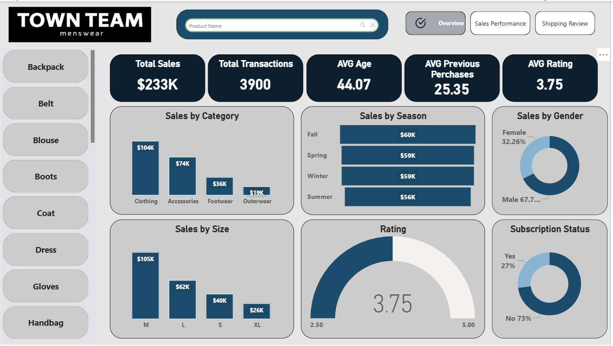

# Town Team Sales Dashboard

## Overview
This project is a comprehensive **Sales Dashboard** for *Town Team* that provides insights into product performance, customer behavior, and sales trends. The dashboard helps the company understand which products are performing well, customer preferences, and the impact of discounts on sales.  

The dashboard covers the following categories and dimensions:  
- Product categories  
- Sales by season  
- Customer gender  
- Product sizes  
- Top 5 products (by sales) and their colors and cities  
- Bottom 5 products (by sales) and their colors and cities  
- Payment methods and shipping options  
- Purchase timing (before or after discounts)  

---

## Key KPIs
The dashboard includes the following Key Performance Indicators (KPIs) to monitor business performance:  
- **Total Sales** – Sum of all sales transactions  
- **Total Invoices** – Number of invoices issued  
- **Average Invoice Value** – Average sales amount per invoice  
- **Average Customer Age** – Average age of the customers  
- **Average Rating** – Average customer product rating  

---

## Dashboard Views

### 1. Overview
High-level summary of sales, customer behavior, and product performance.  

### 2. Sales Performance
Breakdown of sales by category, season, gender, and size.  
Includes top 5 and bottom 5 products with their cities and colors.  

### 3. Shipping Review
Analysis of payment methods, shipping options, and purchase timing regarding discounts.  

---

## Tools & Technologies
- **Data Analysis & Visualization:** Excel, Power BI  
- **Data Sources:** Sales transactions and customer information  

---

## How to Use
1. Open the Power BI file or Excel dashboard  
2. Explore KPIs and filters to analyze specific categories or time periods  
3. Identify trends and insights for decision-making  
